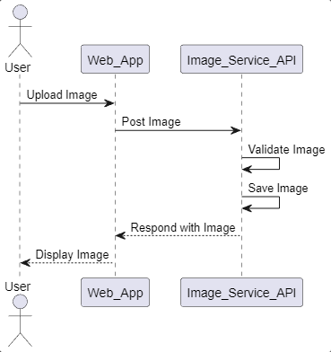

# Microservice
 # Image Service
This is an image serving service that takes an uploaded image and serves it at an endpoint.

## How to request data:
The calling process will make an http request using the url of the process followed by the name of the image.
For example, if the api was running on http://localhost:5000, the desired program or individual would perform an http GET request to:
http://localhost:5000/uploads/image#.jpg 

## How to receive data:
The image is sent as a redirect HTTP response to the URL now serving the image.
### Example call:
@app.route('/display/<filename>')
def display_image(filename):
    return redirect(url_for('static', filename='uploads/' + filename), code=301)

## UML:

